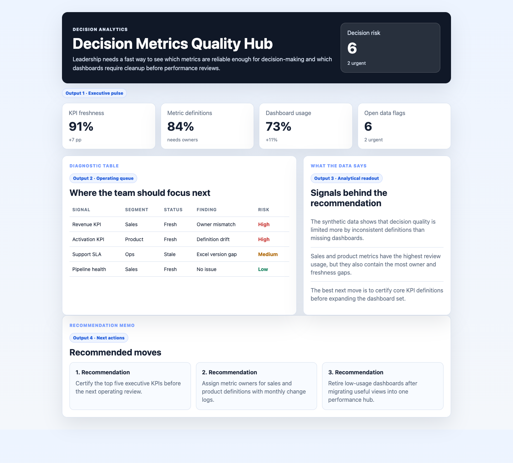

# Decision Metrics Quality Hub

I built this because broad data analyst roles are usually judged by one practical question: can the analyst turn messy cross-functional data into trusted operating decisions? This project focuses on KPI quality, dashboard reliability, and stakeholder-ready explanations across sales, product, and operations workflows.



## Why this exists

Leadership needs a fast way to see which metrics are reliable enough for decision-making and which dashboards require cleanup before performance reviews.

## What is in the project

- A polished dashboard in `index.html`
- Modular UI/data files in `src/`
- Synthetic operating data in `data/synthetic_operating_data.csv`
- A screenshot captured from the rendered app in `docs/images/dashboard.png`

## Dashboard sections

- Metric pulse: KPI freshness, definition quality, dashboard usage, and open data issues.
- Issue queue: stale metrics, owner gaps, Excel inconsistencies, and BI dashboard drift.
- Recommendation memo: actions for metric ownership, reporting cleanup, and stakeholder readouts.

## What the data says

The synthetic data shows that decision quality is limited more by inconsistent definitions than missing dashboards.

Sales and product metrics have the highest review usage, but they also contain the most owner and freshness gaps.

The best next move is to certify core KPI definitions before expanding the dashboard set.

## Output walkthrough

### Output 1: Executive pulse

The KPI cards summarize the current operating picture and highlight whether the team should trust, investigate, or act on the latest metrics.

### Output 2: Diagnostic table

The table converts raw operating signals into a ranked queue of risks, owners, and recommended next actions.

### Output 3: Analytical recommendations

The memo turns the analysis into specific business actions that can be discussed in a weekly review or stakeholder workshop.

## Run locally

```bash
python3 -m http.server 4173
```

Then open `http://localhost:4173`.
