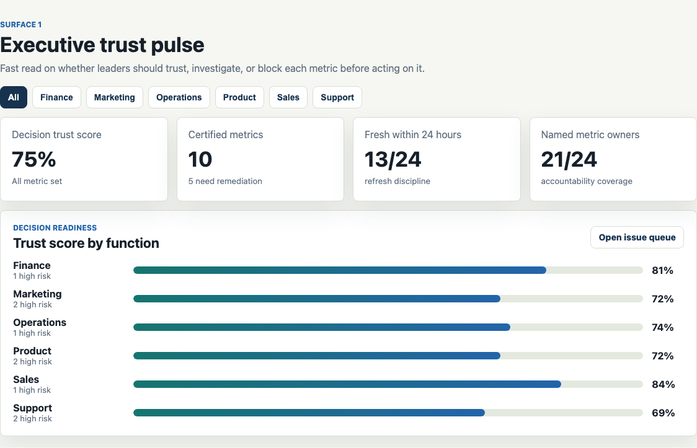
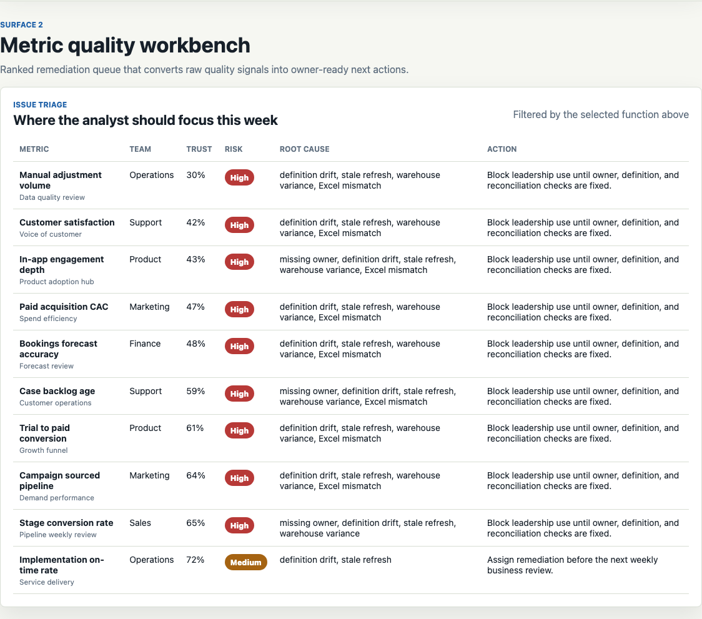
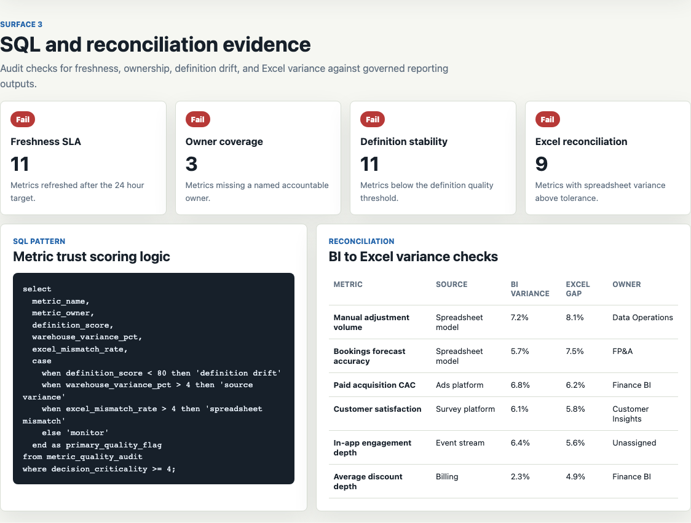

# Decision Metrics Quality Hub

A Data Analyst portfolio artifact for a cross-functional operating team that needs reliable KPIs before leadership makes decisions from dashboards, reports, or spreadsheet extracts.

The project answers one practical question:

> Which business metrics are trustworthy enough to use this week, and which ones need remediation before a stakeholder review?

## Why This Exists

Broad Data Analyst roles are often judged by more than chart polish. The analyst has to collect data, define success metrics, maintain reporting, validate accuracy, and explain findings to non-technical partners. This artifact shows that workflow as a small BI quality product:

- Executive KPI trust pulse for quick decision readiness.
- Metric quality workbench for ranked remediation.
- SQL-style audit logic for data integrity and reconciliation.
- Stakeholder readout that turns findings into plain-English next actions.

## Screenshots

### Executive Trust Pulse

Shows the overall decision trust score, certified metric count, freshness coverage, ownership coverage, and trust score by business function.



### Metric Quality Workbench

Ranks metrics by trust score, risk, root cause, and recommended action so a data analyst can prioritize cleanup with business owners.



### SQL And Reconciliation Evidence

Documents the audit logic behind the quality flags and highlights BI to Excel variance checks for metrics that need review.



## What Is In The Project

- `index.html`: static dashboard shell with four analytical surfaces.
- `src/app.js`: trust scoring, risk classification, filtering, issue ranking, quality checks, and readout generation.
- `src/data.js`: synthetic metric register used by the dashboard.
- `data/synthetic_operating_data.csv`: CSV version of the synthetic data.
- `sql/metric_quality_audit.sql`: SQL pattern for metric scoring and triage.
- `data_dictionary.md`: field definitions and synthesis notes.
- `docs/images/`: screenshots captured from the rendered app.

## Data Strategy

The data is synthetic because no public internal metric register, dashboard usage log, reconciliation file, or operating review dataset is available for this role. The dataset is modeled on a common cross-functional business analytics environment with Sales, Product, Marketing, Finance, Support, and Operations metrics.

Each row represents a governed KPI or recurring dashboard metric. The synthetic data uses these assumptions:

- `freshnessHours`: lower values for warehouse and ERP-backed metrics, higher values for spreadsheet and survey-backed metrics.
- `definitionScore`: higher for mature finance and executive KPIs, lower where ownership or event definitions are unclear.
- `usage30d`: higher for executive, pipeline, product, finance, and support review dashboards.
- `variancePct`: modeled as BI report variance against a governed source extract.
- `excelMismatchRate`: modeled as spreadsheet reconciliation variance against the BI output.
- `issueCount`: combined count of owner, freshness, definition, source, and reconciliation flags.
- `decisionCriticality`: 1 to 5 priority score based on whether leaders use the metric in recurring business decisions.

The data is not real company performance data and should not be interpreted as actual operating results.

## Scoring Logic

The trust score is intentionally transparent rather than machine learned. It rewards strong definitions and dashboard usage, then penalizes stale refreshes, warehouse variance, Excel mismatches, and open data issues. The result is classified as Low, Medium, or High decision risk.

This design keeps the artifact explainable in an interview and aligns with analyst work where business partners need to understand why a metric is blocked, watched, or certified.

## Role Fit

This project demonstrates:

- SQL thinking through audit logic and quality classification.
- BI dashboard design focused on decision-making, not decorative charts.
- Excel reconciliation awareness through variance checks.
- Data accuracy and integrity controls.
- Cross-functional metric ownership across business teams.
- Clear communication for non-technical stakeholders.

## Scope

What this artifact does:

- Simulates a realistic metric quality register.
- Calculates trust score, risk, root causes, and next actions from data.
- Provides multiple surfaces for executive review, analyst triage, SQL evidence, and stakeholder communication.
- Documents the data generation assumptions clearly.

What this artifact does not do:

- It does not connect to a live warehouse, CRM, ERP, BI tool, or spreadsheet.
- It does not claim the synthetic data represents any real company's performance.
- It does not train a predictive model because the target role is BI and decision analytics oriented, with Python or R listed only as a plus.

## Run Locally

```bash
npm start
```

Then open `http://localhost:4173`.
